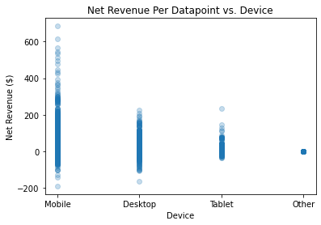

# Lockerdome Technical Assessment
Full Analysis: [master notebook](master_notebook.ipynb)

## Overview
This project details the exploration and analysis of data from a single advertiser between the dates 12/01/2020 and 02/28/2021.

The purpose of this project is to analyze historical campaign data and return intuitive tables and graphics that allow an audience to analyze the data by eye, as well as provide concrete optimization recommendations.

**Important Note: The source data is too large to upload to GitHub. If this project is to be cloned, the data must be added to the data folder of this repo before the master_notebook can be run successfully.**

*For the reader's convenience, the project_data.csv can be downloaded [here](https://drive.google.com/file/d/1l1EGxzQStWMLEnsm8uOU41vteFdkXWhA/view?usp=sharing).*

## Project Goals
Through the lens of optimizing for LockerDome:
- Using raw historical campaign data, make concrete optimization recommendations for Creative.ID, Slot.ID, and Device variables.
- Deliver results as tables and graphics that illustrate results
- Detail any additional observations

## Metric
The main metric in this analysis will be **Net Revenue** (Gross - Publisher Split)

## Data
The data utilized for this project consisted of roughly 5.5M data points.

A summary of the data columns is shown below.


## Methods
#### DataType Correction/Feature Creation
- To begin, the ```Date``` column was converted from an object datatype to a datetime datatype. This allowed that column to be used in a lambda function that populated a new column ```conversion_value```, which was dependent on the date.
- With the conversion value calculated, new columns for ```gross_revenue``` and ```net_revenue``` could be calculated.
#### Dealing With Missing Values
- A tiny percentage of the raw data was missing values in the ```Placement``` or ```Ad.Slot.Page.Layout``` columns. The rows with missing data were dropped from the analysis.
#### Check for Outliers
-Scatterplots of ```net-revenue``` vs ```Creative.ID```, ```Slot.ID```, and ```Device``` were used to visually inspect the data for outliers. No data points were obvious outliers so for the purpose of this analysis no data was dropped at this stage. The scatterplots can be viewed below.



#### Pivot Tables
- To make insights possible to the human eye, data was aggregated into pivot tables.
- The table displayed below shows the sum of all Net Revenue aggregated by device for each Creative ID.
- A heatmap was used to make the pivot table more intuitive to any audience.


#### Deployment
- To make the above pivot table usable for insight on a per-Slot.ID basis, a function was written that filters the dataframe by a user defined Slot.ID and returns a pivot table and heatmap of the same format as the one above, but specifically tailored to the Slot.ID being investigated.
- For ease of use outside of the working notebook, the function was rewritten as a python script that can be run from the terminal. The script prompts the user to input a Slot ID and creates a heatmap that represents Net Revenue for that specific slot.

## Results
In the image below, the left window shows the python script being called and prompting the user to select a Slot ID to analyze. The right screen shows the resulting heatmap generated. 


## Conclusions
- Data collected on this campaign can be pivoted into useful and readable summary tables and heat maps that enable any audience to visually audit the campaign's performance.
- When the entire dataset is aggregated and analyzed across all Slot.IDs, Creative IDs perform significantly differently when presented on different devices.
- If data is filtered by Sort.ID prior to pivot table and heat map creation, top performing ad content can be curiated for each slot and for each device.
- The top performing Creative ID across all slots are 72, 35, and 35 when viewed on Desktop, Mobile, and Tablet respectively.

## Recommendations
- Use heatmap function to curate ad content for each slot ID.
- Use master heatmap created above to analyze the performance of existing ad content and explore if the ad requires updating or modification to better match the performance of higher ranked creative content.
- Consider retiring lowest performing content and increasing the spread of more successful content.

## Future Work
- Explore why some values were missing from initial dataset
- Explore if data aggregation is being skewed by initial post date
- Modify pivot table functions to reflect user defined dates or a range of dates
- Expand python script to take user input for the date being analyzed
- Expand python script to create heatmap for all Slot.IDs or a selection of Slot.IDs if prompted.
- Extrapolate the data to predict future performance with Machine Learning

## For More Information
For more detailed information, please review my full analysis in [my Jupyter Notebook](master_notebook.ipynb).

For any additional questions, please contact me by email: **carlosjgarza89@gmail.com**
